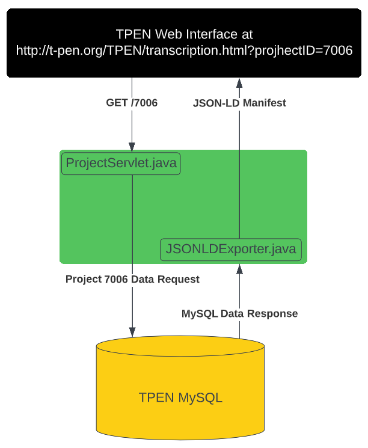
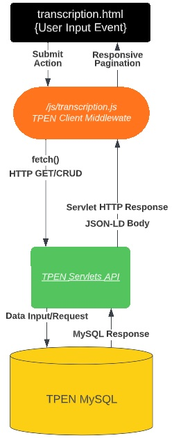
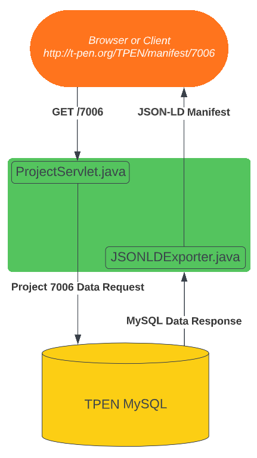

# TPEN Contributors Guide


## 1. Welcome

### 1.1 Thank You!
Thank you for considering contributions to the TPEN source code.  TPEN relies on Open Source contributions to stay current with Linked Data best practices occurring all over the web.  Below you will find guides and guidelines for contributing to the code.

### 1.2 Code of Conduct
Use this as a model maybe https://iiif.io/event/conduct/, or perhaps just say TPEN adopts this code of conduct??  We will probably also link to mention the LICENSE.md here.

## 2. Table of Contents
[Wecome](#welcome)
 * [Thank You](#thank-you)
 * [Code of Conduct](#code-of-conduct)
 
[Table of Contents](#table-of-contents)

[Introduction](#introduction)

[Code Free Contributions](#code-free-contributions)
 * [Help!](#help)
 * [Submit a (Good) Bug Report](#submit-a-good-bug-report)
 * [Submit a (Good) Enhancement Suggestion](#submit-a-good-enhancement-suggestion)

[Source Code Contributions](#source-code-contributions)
 * [Make Issue(s) First](#make-issues-first)
 * [Make a Branch](#branch-next)
 * [Make a Pull Request](#make-pull-request)

[TPEN User Interfaces Front End](#tpen-user-interfaces-front-end)
 * [HTML + JS + CSS Interfaces](#html-js-css-interfaces)
 * [Transcription Interface](#transcription-interface)
 * [Interface Diagram](#interface-diagram)
 * [Other Interfaces](#other-interfaces)

[TPEN Java Back End](#tpen-java-back-end)
 * [Servlets and Classes](#servlets-and-classes)
 * [Example Servlets](#example-servlets)
 * [Servlet Diagram](#servlet-diagram)

[Localhost Development](#localhost-development)

[Localhost Testing](#localhost-development)

[How Your Code Makes It To Production](#code-contribution-and-development-testing)

[Additional Information](#additional-information)

## 3. Introduction

### 3.1 Architecture From High Up
TPEN's greatest contribution to the internet is the Linked Open Data it produces, stores and makes available. The TPEN 2.8 distribution does this with Java Classes, a bulk of which are HTTPServlets mapped by a web.xml document Spring and Struts style. The data is stored in a MySQL database. The proper data is queried for by a Servlet or Class then reconfigured as JSON-LD by that class, then sent on in the body of a HTTPServletResponse to clients.

TPEN's greatest use case is Line by Line Transcription of Manuscripts. The response from the Java servlets is processed by Javascript middleware that builds it into a HTML User Interface. Users can set up projects based off of particular manuscripts then build teams around those projects for transcribing all pertinent lines on pertinent pages. Project Management, User Management, Admin Reports, and Transcription interfaces exist to give users the controls necessary to do all this. Those interfaces interact with existing Servlets to take data from a user in the interface to the MySQL database, and then back when necessary.

To follow are guides for where to begin based on how you would like to contribute and what you would like to contribute to.
-  Submit a Bug Report
-  Submit an Enhancement Suggestion
-  Contribute Code for the TPEN User Interfaces Front End
-  Contribute Code for the TPEN Servlets Back End

## 4. Code Free Contributions

### 4.1 Help!
_DO NOT_ submit an issue if you need technical support.  Contact the webmaster E-mail research.computing@slu.edu.  They will respond to help with your specific situation.  Have a wonderful rest of the day.

### 4.2 Submit a (Good) Bug Report
Your job when submitting the bug report is to supply as much information as possible.  This will help teh technical team understand your report:pencil:, reproduce the behavior :computer: :computer:, and find related reports :mag_right:.

Bugs are tracked as [GitHub issues](https://guides.github.com/features/issues/). Before creating bug reports, please perform a **[cursory search](https://github.com/CenterForDigitalHumanities/TPEN28/issues?q=is%3Aissue+is%3Aopen)** to see if the problem has already been reported. If it has **and the issue is still open**, add a comment to the existing issue instead of opening a new one.

> **Note:** If you find a **Closed** issue that seems like it is the same thing that you're experiencing, open a new issue and include a link to the original issue in the body of your new one.

Explain the problem and include additional details to help maintainers reproduce the problem:

* **Use a clear and descriptive title** for the issue to identify the problem.
* **Note which web browser you were using.**
* **Describe the exact steps which reproduce the problem** in as many details as possible. For example, start by copying exactly what URL is in your address bar. When listing steps, **don't just say what you did, but explain how you did it**. For example, if you moved the cursor to the end of a line, explain if you used the mouse, or a keyboard shortcut or a hotkey command, and if so which one?
* **Describe the behavior you observed after following the steps** and point out what exactly is the problem with that behavior.
* **Explain which behavior you expected to see instead and why.**
* **Include screenshots or animated GIFs** which show you following the described steps and clearly demonstrate the problem.  You can use [this tool](https://www.cockos.com/licecap/) to record GIFs on macOS and Windows, and [this tool](https://github.com/colinkeenan/silentcast) or [this tool](https://github.com/GNOME/byzanz) on Linux.
* **If the problem wasn't triggered by a specific action**, describe what you were doing before the problem happened.

### 4.3 Submit a (Good) Enhacement Suggestion
Enhancement suggestions are tracked as [GitHub issues](https://guides.github.com/features/issues/).  Before creating an issue for your suggestion, please perform a **[cursory search](https://github.com/CenterForDigitalHumanities/TPEN28/issues?q=is%3Aissue+is%3Aopen)** to see if there is a related suggestion. If one exists **and the issue is still open**, add a comment to the existing issue instead of opening a new one. Create an issue on the TPEN28 repository and provide the following information:

* **Use a clear and descriptive title** for the issue to identify the suggestion.
* **Provide a step-by-step description of the suggested enhancement** in as many details as possible.
* **Provide specific examples to demonstrate the steps**. Include copy/pasteable snippets which you use in those examples, as [Markdown code blocks](https://help.github.com/articles/markdown-basics/#multiple-lines).
* **Describe the current behavior** and **explain which behavior you expected to see instead** and why.
* **Include screenshots and animated GIFs** which help you demonstrate the steps or point out the part of TPEN which the suggestion is related to. You can use [this tool](https://www.cockos.com/licecap/) to record GIFs on macOS and Windows, and [this tool](https://github.com/colinkeenan/silentcast) or [this tool](https://github.com/GNOME/byzanz) on Linux.
* **Explain why this enhancement would be useful** to most TPEN users.
* **List some other text editors, transcription platforms or applications where this enhancement exists.**
* **Specify which browser and browser version you're' using.**
* **Specify the name and version of the OS you're using.**

## 5. Source Code Contributions
Unsure where to begin? You can start by looking through these `beginner` and `help-wanted` issues:

* [Beginner issues][beginner] - issues which should only require a few lines of code, and a test or two.
* [Help wanted issues][help-wanted] - issues which should be a bit more involved than `beginner` issues.
  
This section wil explain the general flow for contributing code.  The sections after will specifically guide you to the code file you are looking for.

### 5.1 Make Issue(s) First
First [make an issue in the TPEN GitHub repository](https://github.com/CenterForDigitalHumanities/TPEN28/issues) that clearly explains what your contribution is for.  Look through the details of sections 4.2 and 4.3 for some ice breakers.

### 5.2 Branch Next
Next make a branch for you work.  Name it like `{issue number}-{name}`. Example `1-transcription-hotfix`.

### 5.3 Pull Request to Submit
We suggest you open a Draft Pull Request early in the process.  This will ensure you have branches, and give others a place to easily look at your work under a specific namespace.  Once you have completed your work, you can take it out of draft (or make it if you had not yet).  Pull Requests will be reviewed and comments will be left on the Pull Request if there are suggested code changes.

## 6. TPEN User Interfaces Front End

### 6.1 HTML + JS + CSS Interfaces
TPEN offers various interfaces which offers users the ability to set up projects built around manuscripts and perform line by line transcription of those manuscripts. The HTML, CSS and Javascript files are located in the `/web` directory.

### 6.2 Transcription Interface
We will look specifically at the transcription interface located in `/web/transcription.html` which uses the script file `/web/js/transcribe.js` to `fetch()` data using the available TPEN servlets.  In this case, the TPEN interface acts as the client.

### 6.3 Interface Diagram
<p align="middle">
     
</p>

### 6.4 Other Interfaces
The other interfaces in TPEN work the same way.  Other high use interfaces include
 - Line Parsing (transcription.html)
 - Project Management (project.jsp)
 - Project Group Management (group.jsp, groupmembers.jsp)
 - User's Projects Dashboard (index.jsp)

## 7. TPEN Java Back End

### 7.1 Servlets and Classes
TPEN uses Java 8 through those most recent JDK.  The Java Classes which extend [HTTPServlet](https://javaee.github.io/javaee-spec/javadocs/javax/servlet/http/HttpServlet.html) are considered "Java Servlets".  There are also various Java Classes that back end duties which are not exposed to users, though some of them contain helper functions for the Java Servlets.

- The classes are located throughout `/src/java/`.  Critical classes include
    + `/textdisplay/Folio.java`
    + `/textdisplay/Project.java`
    + `/edu/slu/tpen/entity/image/Canvas.java`
    + `/edu/slu/tpen/transfer/JSONLDExporter.java`
    + `/user/User.java`
    + `/user/Group.java`
- The servlets are located in `/src/java/slu/edu/tpen/servlet`.  Critical servlets include
    + `ProjectServlet.java`
    + `CanvasServlet.java`
    + `GetProjectTPENServlet.java`
    + `UserInfoServlet.java`
- The URL patterns for the servlet are recorded in `/web/WEB-INF/web.xml`

### 7.2 Example Servlet
TPEN offers an endpoint for any user project that returns a IIIF Presentation API Manifest JSON-LD representation of the project.  The JSON-LD contains the image URIs, the segments of interest from those images, and text to go along with those segments.

Here is a diagram of what happens when a user asks for a particular Manifest like http://t-pen.org/TPEN/manifest/7006

### 7.3 Servlet Diagram
- /src/java/slu/edu/tpen/servlet/ProjectServlet.java
- /src/java/slu/edu/tpen/transfer/JSONLDExporter.java
- web.xml maps the URL pattern to those files via the following entry
```
<servlet>
    <servlet-name>ProjectServlet</servlet-name>
    <servlet-class>edu.slu.tpen.servlet.ProjectServlet</servlet-class>
</servlet>
<servlet-mapping>
    <servlet-name>ProjectServlet</servlet-name>
    <url-pattern>/manifest/*</url-pattern>
</servlet-mapping>
```


## 8. Localhost Development

## 9. Localhost Testing

## 10. How Your Code Makes It To Production

## 11. Additional Information
